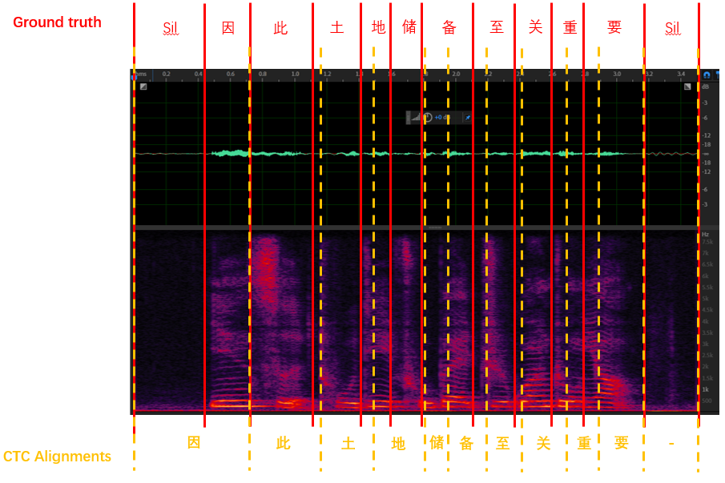

# Athena

*Athena* is an open-source implementation of end-to-end speech processing engine. Our vision is to empower both industrial application and academic research on end-to-end models for speech processing. To make speech processing available to everyone, we're also releasing example implementation and recipe on some opensource dataset for various tasks (Automatic Speech Recognition, Speech Synthesis, Voice activity detection, Wake Word Spotting, etc).

All of our models are implemented in Tensorflow>=2.0.1. For ease of use, we provide Kaldi-free pythonic feature extractor with [Athena_transform](https://github.com/athena-team/athena-transform).


## Key Features

- Hybrid Attention/CTC based end-to-end and streaming methods(ASR)
- Text-to-Speech(FastSpeech/FastSpeech2/Transformer)
- Voice activity detection(VAD)  
- Key Word Spotting with end-to-end and streaming methods(KWS)
- ASR Unsupervised pre-training(MPC)
- Multi-GPU training on one machine or across multiple machines with Horovod
- WFST creation and WFST-based decoding with C++
- Deployment with Tensorflow C++(Local server)

## What's new
- 2022/06/01 The [Athena-model-zoo](https://github.com/LianjiaTech/athena-model-zoo.git) is built. 
- 2022/05/13 The runtime supports [C++ decoding](runtime/core)(E2E, Streaming, WFST, PrefixBeamSearch etc) and [Deployment](runtime/server)
- 2022/05/10 The functions about [adding noise and rir](athena/transform/feats/add_rir_noise_aecres_test.py) aecres to clean noise are added to the transform
- 2022/04/25 The functions about [KWS](athena/models/kws) are added to Athena-v2.0
- 2022/04/07 The [AV-Cransformer](athena/models/asr/av_conformer.py) for ASR and [MISP2021 task2 example](examples/asr/misp) are added to Athena-v2.0
- 2022/04/05 The [Transformer-U2](athena/models/asr/speech_u2.py) and examples are added to Athena-v2.0
- 2022/03/20 The [CTC alignment function](examples/align) is add to Athena-v2.0
- 2022/03/10 [Vad function](athena/models/vad) and examples are add to Athena-v2.0
- 2022/03/09 The [Fastspeech2](athena/models/tts/fastspeech2.py) is added to Athena-v2.0
- 2022/03/02 Add [speaker embedding](athena/models/tts/fastspeech.py) to Athena-v2.0
- 2021/11/27 The [Conformer-CTC](athena/models/asr/speech_conformer_ctc.py) is added to Athena-v2.0
- 2021/10/31 ASR Performances updates of these [E2E ASR examples](examples/asr) (AISHELL-1, HKUST, GigaSpeech, LibriSpeech) 
- 2021/09/01 The [Beamsearch and Attention rescoring](athena/models/asr/mtl_seq2seq.py) are updated
- 2021/08/18 The [Batchbins function](athena/data/datasets/asr/speech_recognition_batch_bins.py) is added to Athena-v2.0
- 2021/06/01 [Language model](athena/models/lm) updates and add Transformer model structure
- 2021/05/19 The parameters of [Horovod](https://github.com/horovod/horovod.git) are adjusted to speed up the training
- 2021/05/07 These training parameters of [E2E ASR](athena/models/asr/) models are adjusted
- 2021/04/09 [SpecAugment](athena/data/datasets/preprocess.py) bug is fixed

## 1) Table of Contents

- [Athena](#athena)
  - [1) Table of Contents](#1-table-of-contents)
  - [2) Installation ](#3-installation)
  - [3) Results](#3-results)
    - [3.1) ASR](#31-asr)
    - [3.2) TTS](#32-tts)
    - [3.3) VAD](#33-vad)
    - [3.4) KWS](#34-kws)
    - [3.5) CTC-Alignment](#35-ctc-alignment)
    - [3.6) Deploy](#36-deploy)
  - [4) Run demo ](#3-rundemo)
  - [5) Supported Model architectures and reference](#5-supported-model-architectures-and-reference)  
  - [6) Directory Structure](#6-directory-structure)
  - [7) Acknowledgement](#7-acknowledgement)

## 2) Installation
Athena can be installed based on Tensorflow2.3 and Tensorflow2.8 successfully.
- Athena-v2.0 installed based on Tensorflow2.3:
```bash
pip install tensorflow-gpu==2.3.0

pip install -r requirements.txt

python setup.py bdist_wheel sdist

python -m pip install --ignore-installed dist/athena-2.0*.whl
```
- Athena-v2.0 installed based on Tensorflow2.8:

```bash
pip install tensorflow-gpu==2.8.0

pip install -r requirements.txt

python setup.tf2.8.py bdist_wheel sdist

python -m pip install --ignore-installed dist/athena-2.0*.whl
```

## 3) Results

### 3.1) ASR

The performances of a part of models are shown as follow:

<details><summary>expand</summary><div>


|       Model       |  LM | HKUST | [AISHELL1 Dataset](http://www.openslr.org/33/) |      | [LibriSpeech Dataset](http://www.openslr.org/12/)  |            |             |             | [Giga](https://github.com/SpeechColab/GigaSpeech/) |       |  [MISP](https://mispchallenge.github.io/task2_data.html) | Model link |
|:-----------------:|:---:|:-----:|:--------:|:----:|:-----------:|:----------:|:-----------:|:-----------:|:----:|:-----:|:-----:|------------|
|                   |     |  CER% |   CER%   |      |     WER%    |            |             |             | WER% |       |  CER% |            |
|                   |     |  dev  |    dev   | test |  dev _clean | dev _other | test_ clean | test_ other |  dev |  test |   -   |            |
|    transformer    |  w  | 21.64 |     -    | 5.13 |      -      |      -     |      -      |      -      |   -  | 11.70 |   -   |            |
|                   | w/o | 21.87 |     -    | 5.22 |     3.84    |      -     |     3.96    |     9.70    |   -  |   -   |   -   |            |
|   transformer-u2  |  w  |   -   |     -    |   -  |      -      |      -     |      -      |      -      |   -  |   -   |   -   |            |
|                   | w/o |   -   |     -    | 6.38 |      -      |      -     |      -      |      -      |   -  |   -   |   -   |            |
| conformer |  w  | 21.33 |     -    | 4.95 |      -      |      -     |      -      |      -      |   -  |   -   | 50.50 |            |
|                   | w/o | 21.59 |     -    | 5.04 |      -      |      -     |      -      |      -      |   -  |   -   |   -   |            |
|    conformer-u2   |  w  |   -   |     -    |   -  |      -      |      -     |      -      |      -      |   -  |   -   |   -   |            |
|                   | w/o |   -   |     -    | 6.29 |      -      |      -     |      -      |      -      |   -  |   -   |   -   |            |
|   conformer-CTC   |  w  |   -   |     -    |   -  |      -      |      -     |      -      |      -      |   -  |   -   |   -   |            |
|                   | w/o |   -   |     -    | 6.60 |      -      |      -     |      -      |      -      |   -  |   -   |   -   |            |

</div></details>

To compare with other published results, see [wer_are_we.md](docs/tutorials/wer_are_we.md).

More details of U2, see [ASR readme](examples/asr/README.md)  


### 3.2) TTS
Currently supported TTS tasks are LJSpeech and Chinese Standard Mandarin Speech Copus(data_baker). Supported models are shown in the table below:
(Note:HiFiGAN is trained based on [TensorflowTTS](https://github.com/TensorSpeech/TensorFlowTTS))

The performance of Athena-TTS are shown as follow:

<details><summary>expand</summary><div>

Traing Data | Acoustic Model | Vocoder |  Audio Demo
:---------: |:-------------: | :-------------:| :------------:
data_baker  |Tacotron2       | GL             |  [audio_demo](examples/tts/data_baker/audio_demo/)
data_baker  |Transformer_tts | GL             |  [audio_demo](examples/tts/data_baker/audio_demo/)
data_baker  |Fastspeech      | GL             |  [audio_demo](examples/tts/data_baker/audio_demo/)
data_baker  |Fastspeech2     | GL             |  [audio_demo](examples/tts/data_baker/audio_demo/)
data_baker  |Fastspeech2     | HiFiGAN        |  [audio_demo](examples/tts/data_baker/audio_demo/)
ljspeech    |Tacotron2       | GL             |  [audio_demo](examples/tts/ljspeech/audio_demo/)

</div></details>

More details see [TTS readme](examples/tts/README.md)

### 3.3) VAD

<details><summary>expand</summary><div>

Task | Model Name |      Training Data      | Input Segment | Frame Error Rate 
:-----------: | :------: | :------------: | :-----: | :----------:
VAD  | DNN | Google Speech Commands Dataset V2 | 0.21s | 8.49% 
VAD  | MarbleNet | Google Speech Commands Dataset V2 | 0.63s | 2.50%

</div></details>

More details see [VAD readme](examples/vad/README.md)

### 3.4) KWS

The performances on [MISP2021 task1](https://mispchallenge.github.io/task1_data.html) dataset are shown as follow:

<details><summary>expand</summary><div>

|  KWS Type |      Model     |         Model Detail        |         Data         |   Loss   |  Dev  |  Eval |
|:---------:|:--------------:|:---------------------------:|:--------------------:|:--------:|:-----:|:-----:|
| Streaming |     CNN-DNN    |        2 Conv+3 Dense       |   60h pos+200h neg   |    CE    | 0.314 |   /   |
|    E2E    |      CRNN      |        2 Conv+2 biGRU       |   60h pos+200h neg   |    CE    | 0.209 |   /   |
|    E2E    |      CRNN      |        Conv+5 biLSTM        |   60h pos+200h neg   |    CE    | 0.186 |   /   |
|    E2E    |      CRNN      |        Conv+5 biLSTM        |   170h pos+530h neg  |    CE    | 0.178 |   /   |
|    E2E    |  A-Transformer |   Conv+4 encoders+1 Dense   |   170h pos+530h neg  | CE&Focal | 0.109 | 0.106 |
|    E2E    |   A-Conformer  |   Conv+4 encoders+1 Dense   |   170h pos+530h neg  | CE&Focal | 0.105 | 0.116 |
|    E2E    | AV-Transformer | 2 Conv+4 AV-encoders+1Dense | A(170h pos+530h neg)+V(Far 124h)  |    CE        | 0.132 |   /   |

</div></details>

More details you can see: [KWS readme](examples/kws/README.md)
### 3.5) CTC-Alignment
The CTC alignment result of one utterance is shown below, we can see the output of ctc alignment is with time delayed:

<details><summary>expand</summary><div>

<div align="left"></div>

</div></details>

More details see: [Alignment readme](examples/align/README.md)
### 3.6) Deploy

Athena-V2.0 deployment only support the ASR. All the experiments are conducted on a CPU machine with 2.10GHz and 104 logic cores. We evaluate the performance on AIShell datasets. The results are shown as follow:

<details><summary>expand</summary><div>

| Logic Core | Decoder Type          | Beamsize | RTF     | Character Accuracy |
|------------|-----------------------|----------|---------|--------------------|
| 1          | BeamSearch            | 1        | 0.0881  | 92.65%             |
|            |                       | 10       | 0.2534  | 93.07%             |
|            |                       | 20       | 0.4537  | 93.06%             |
| 10         |                       | 1        | 0.04792 | 92.65%             |
|            |                       | 10       | 0.1135  | 93.07%             |
|            |                       | 20       | 0.1746  | 93.06%             |
| 1          | CTC Prefix BeamSearch | 1        | 0.0543 | 93.60%             |
|            |                       | 10       | 0.06  | 93.60%             |
|            |                       | 20       | 0.0903  | 93.60%             |
| 10         |                       | 1        | 0.0283 | 93.60%             |
|            |                       | 10       | 0.038  | 93.60%             |
|            |                       | 20       | 0.0641   | 93.60%             |

</div></details>

More detail see: [Runtime readme](runtime/core/README.md)

## 4)Run demo
We provide a quick experience method as follow:
```shell
cd athena
source tools/env.sh
#ASR test
# Batch decoding test
python athena/run_demo.py --inference_type asr --saved_model_dir examples/asr/aishell/models/freeze_prefix_beam-20220620 --wav_list test.lst
# One wav test
python athena/run_demo.py --inference_type asr --saved_model_dir examples/asr/aishell/models/freeze_prefix_beam-20220620 --wav_dir aishell/wav/test/S0764/BAC009S0764W0121.wav

#TTS test
python athena/run_demo.py --inference_type tts --text_csv examples/tts/data_baker/test/test.csv --saved_model_dir athena-model-zoo/tts/data_baker/saved_model  
```

There are some pre-trained models and you can find at:
[Athena-model-zoo](https://github.com/LianjiaTech/athena-model-zoo.git)

More examples you can find at:

[ASR examples](examples/asr)

[TTS examples](examples/tts)

[VAD examples](examples/vad)

[KWS examples](examples/kws)

[Alignment examples](examples/align)

[C++ Decoder](runtime/core)

[Server](/runtime/server)

## 5) Supported Model architectures and reference

The Athena-v2.0 can support these architectures:

<details><summary>expand</summary><div>

| Model Name                                               | Task | Referenced Papers                                                                                                                                                                                                                                                  |
|----------------------------------------------------------|------|-------------------------------------------------------------------------------------------------------------------------------------------------------------------------------------------------------------------------------------------------------------------|
| Transformer                                              | ASR  | Dong L, Xu S, Xu B. Speech-transformer: a no-recurrence sequence-to-sequence model for speech recognition[C]//2018 IEEE International Conference on Acoustics, Speech and Signal Processing (ICASSP). IEEE, 2018: 5884-5888.                                                                                                                                     |
| Conformer                                                | ASR  |  Gulati A, Qin J, Chiu C C, et al. Conformer: Convolution-augmented transformer for speech recognition[J]. arXiv preprint arXiv:2005.08100, 2020.                                                                                                                 |
| Transformer-U2                                           | ASR  | Yao Z, Wu D, Wang X, et al. Wenet: Production oriented streaming and non-streaming end-to-end speech recognition toolkit[J]. arXiv preprint arXiv:2102.01547, 2021.                                                                                               |
| Conformer-U2                                             | ASR  | Yao Z, Wu D, Wang X, et al. Wenet: Production oriented streaming and non-streaming end-to-end speech recognition toolkit[J]. arXiv preprint arXiv:2102.01547, 2021.                                                                                               |
| AV_Transformer                                           | ASR  |                                                                                                                                                                                                                                                                   |
| AV_Conformer                                             | ASR  |                                                                                                                                                                                                                                                                   |
| Fastspeech                                               | TTS  | Ren Y, Ruan Y, Tan X, et al. Fastspeech: Fast, robust and controllable text to speech[J]. Advances in Neural Information Processing Systems, 2019, 32.                                                                                                            |
| Fastspeech2                                              | TTS  | Ren Y, Hu C, Tan X, et al. Fastspeech 2: Fast and high-quality end-to-end text to speech[J]. arXiv preprint arXiv:2006.04558, 2020.                                                                                                                               |
| Tacotron2                                                | TTS  | Shen J, Pang R, Weiss R J, et al. Natural tts synthesis by conditioning wavenet on mel spectrogram predictions[C]//2018 IEEE international conference on acoustics, speech and signal processing (ICASSP). IEEE, 2018: 4779-4783.                                 |
| TTS_Transfprmer                                          | TTS  | Li N, Liu S, Liu Y, et al. Neural speech synthesis with transformer network[C]//Proceedings of the AAAI Conference on Artificial Intelligence. 2019, 33(01): 6706-6713.                                                                                           |
| Marblenet                                                | VAD  | Jia F, Majumdar S, Ginsburg B. Marblenet: Deep 1d time-channel separable convolutional neural network for voice activity detection[C]//ICASSP 2021-2021 IEEE International Conference on Acoustics, Speech and Signal Processing (ICASSP). IEEE, 2021: 6818-6822. |
| DNN                                                     | VAD  |   Tashev I, Mirsamadi S. DNN-based causal voice activity detector[C]//Information Theory and Applications Workshop. 2016.                                                                                                                                                                                                                                                                |
| CNN-DNN, CRNN, A-Transformer, A-Conformer, AV-Transformer | KWS  | Xu Y, Sun J, Han Y, et al. Audio-Visual Wake Word Spotting System for MISP Challenge 2021[C]//ICASSP 2022-2022 IEEE International Conference on Acoustics, Speech and Signal Processing (ICASSP). IEEE, 2022: 9246-9250.                                          |

</div></details>

## 6) Directory Structure

Below is the basic directory structure for Athena

<details><summary>expand</summary><div>

```bash
|-- Athena
|   |-- data  # - root directory for input-related operations
|   |   |-- datasets  # custom datasets for ASR, TTS and pre-training
|   |-- layers  # some layers
|   |-- models  # some models
|   |-- tools # contains various tools, e.g. decoding tools
|   |-- transform # custom featureizer based on C++
|   |   |-- feats
|   |   |   |-- ops # c++ code on tensorflow ops
|   |-- utils # utils, e.g. checkpoit, learning_rate, metric, etc
|-- docker
|-- docs  # docs
|-- examples  # example scripts for ASR, TTS, etc
|   |-- asr  # each subdirectory contains a data preparation scripts and a run script for the task
|   |   |-- aishell
|   |   |-- hkust
|   |   |-- librispeech
|   |   |-- gigaspeech
|   |   |-- misp
|   |-- kws ## Word wake spotting
|   |   |-- misp
|   |   |-- xtxt
|   |   |-- yesno
|   |-- tts ## TTS examples
|   |   |-- data_baker
|   |   |-- ljspeech
|   |-- vad #VAD example
|       |--google_dataset_v2
|-- tools  # need to source env.sh before training
```
</div></details>

#7) Acknowledgement

We want to thank [Espnet](https://github.com/espnet/espnet), [Wenet](https://github.com/wenet-e2e/wenet), [TensorFlowTTS](https://github.com/TensorSpeech/TensorFlowTTS/), [NeMo](https://github.com/NVIDIA/NeMo), etc. These great projects give us lots of references and inspirations!