# 语音特征简介

## 语音数据
在进行特征处理前，我们需要从wav格式的音频文件获取音频数据和采样率。read_wav.py提供了ReadWav的接口，使用如下：

	config = {'sample_rate': 16000.0}
	wav_path = 'sm1_cln.wav''
	read_wav = ReadWav.params(config).instantiate()
	audio_data, sample_rate = read_wav(wav_path)

获得的音频数据时float类型的，范围为[-1, 1]。原始信号在时域上的表示如下图所示：
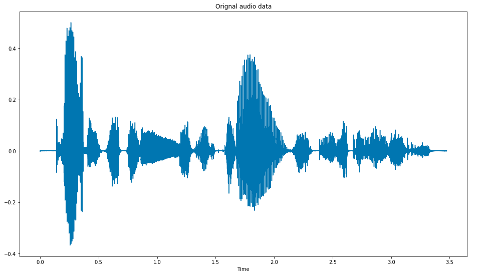

## 短时傅里叶变换(STFT)
语音在时域上变化是快速且比较复杂的，我们常常需要采用傅里叶变换将其转换到频域上。对数字语音信号进行的傅里叶变换即为短时傅里叶变换(Short Time Fourier Transform， STFT)。STFT的一般分为预加重(可选)、分帧、加窗、傅里叶变换这几个步骤。
### 预加重
由于语音信号的平均功率谱受到声门激励和口鼻辐射的影响，高频段大约在800Hz以上以6dB/倍频程跌落，所以求语音信号频谱时，频率越高相应成分越小。预加重的目的在于提高高频成分，使信号的频谱变得平坦，保持在低频到高频的整个频带中能够用同样的信噪比求频谱，以便于频谱分析。一般通过一阶FIR高通滤波器来实现预加重，其传递函数为(a为预加重系数)：
	
	y(n) = x(n) - ax(n-1), 0.9 < a < 1.0
语音信号经过预加重前后的频谱对比如下图所示(a=0.97)。
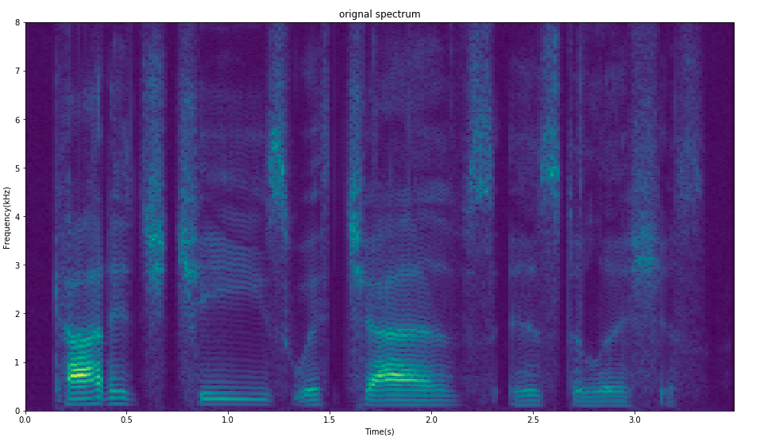
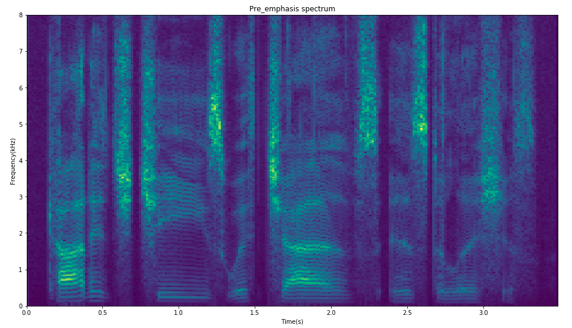

### 分帧
傅里叶变换要求信号是平稳的，但是语音在宏观上是不平稳的，所以我们首先需要将语音信号切割成较短固定长度的时间片段【即分帧】，此时语音信号可以看成是平稳的。帧长需要满足：①足够短保证帧内信号是平稳的，所以一帧的长度应小于一个音素的长度[50-200ms]；②必须包含足够多的振动周期，而语音中的基频男声为100Hz(T=10ms)，女声为200Hz(T=5ms)，所以一般至少取20ms。综上，帧长一般为20-50ms，即frame_length=0.002-0.005(单位s)。kaldi默认帧长为0.025ms，帧移位0.010ms。
### 加窗
对时域信号进行截断，若非周期截断就会产生频谱泄露。为了降低频谱泄露误差，我们需要使用加权函数，即窗函数，使时域信号似乎更好地满足傅里叶变换的周期性要求。每帧信号与一个平滑的窗函数相乘，可以让帧两端平滑衰减到零，这样可以降低傅里叶变换后旁瓣的强度，取得更高质量的频谱。常见的窗函数有矩形窗、汉宁窗、汉明窗等。加窗的代价是一帧信号的两端部分被削弱了，为了避免信息丢失，我们需要对其进行弥补——不要背靠背地截取而是相互重叠一部分。相邻两帧的起始位置的时间差即为帧移，一般取帧长的0-0.5。即hop_length=(0-0.5) * frame_length。
常见的汉明窗对应的窗函数如下(N是语音总样本数，n是0-N的整数)：

### 快速傅里叶变换(FFT)
我们获取的是数字音频，因此我们需要进行离散傅里叶变换(DFT)。其数学公式如下：

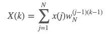

由于DFT的计算复杂度较高，我们通常使用的是快速傅里叶变换(FFT)。FFT的点数(Nfft)一般取2的整数次幂，且必须大于等于一帧信号的样本点数，如果帧长为400样本点，则Nfft必须大于等于512。帧长不等于Nfft时可以采用补零操作。频谱的分辨率精度=采样率/Nfft，第m个频点对应的频率f(m)=m × 频率分辨率。
对于单通道语音，我们获取到的是一个复数矩阵，维度为(num_Frequencies, num_frames)，代表该语音信号是由num_Frequencies个不同相位的正弦波组合而成。对于每一个时频点，FFT的绝对值是该频率对应的正弦波的幅度，相位就是正弦波的初始相位，因此对应的频谱分别称为幅度谱和相位谱，如下图所示。

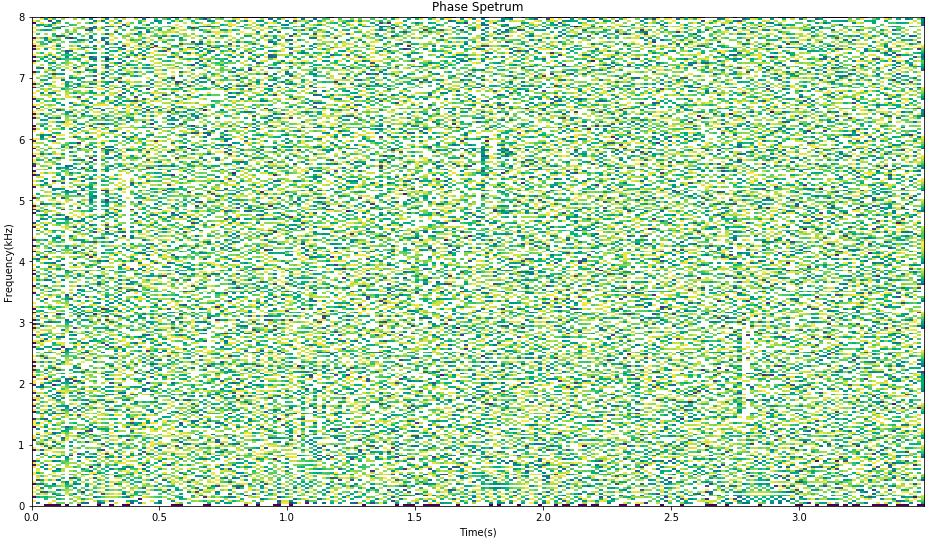

## 功率谱（Spectrum）
计算STFT后，我们得到了频域的信号。每个频带范围的能量大小不一，不同的音素的能量谱不一样。其计算公式为：

常用的还有log谱，即logP = 10 × log(P)。功率谱和log功率谱如下图所示。
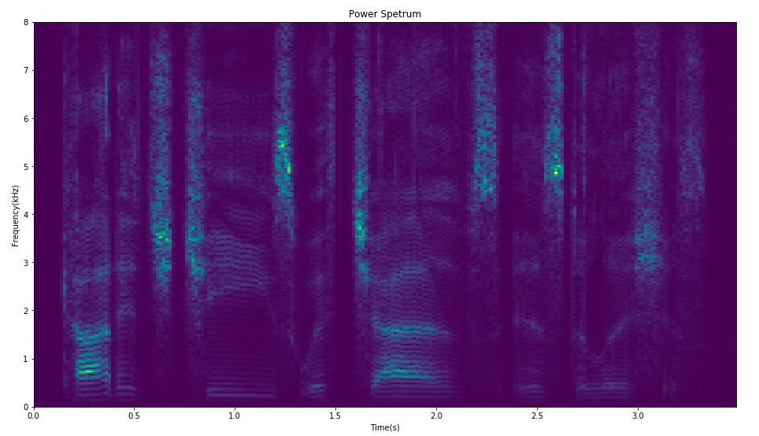
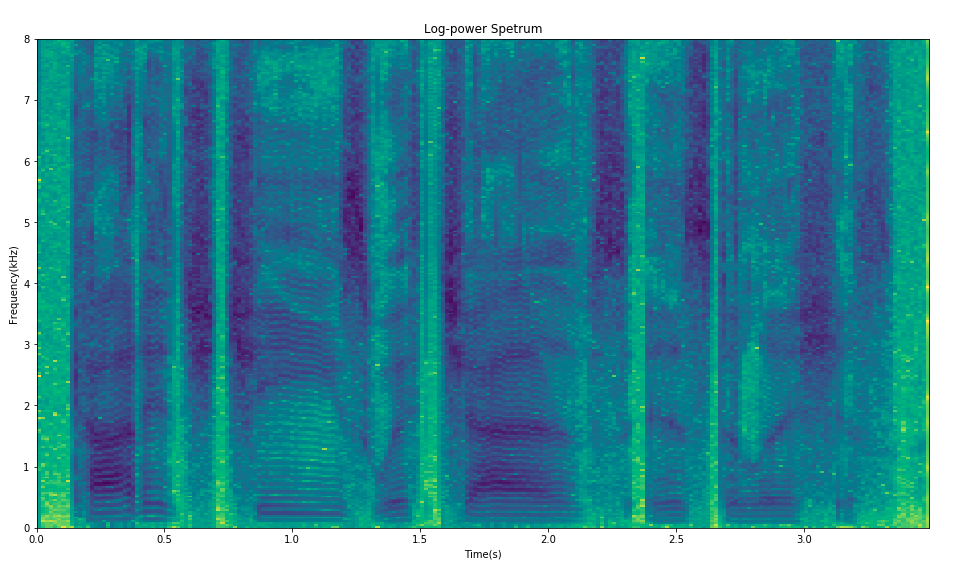

## FliterBank
人耳对声音频谱的响应是非线性的，人耳对于低频声音的分辨率要高于高频的声音。经验表明：如果我们能够设计一种前端处理算法，以类似于人耳的方式对音频进行处理，可以提高语音识别的性能。FilterBank就是这样的一种算法。在功率谱的基础上获取FBank特征，需要进行Mel滤波和取对数运算。
### Mel滤波
通过把频率转换成Mel频率，我们的特征就能够更好的匹配人类的听觉感知效果。频率f和Mel频率m的转换公式如下：

#### Mel滤波器组
Mel滤波器组是一组大约数量为20-40(kaldi默认为23，MFCC为26)的三角滤波器，每一个三角窗滤波器覆盖的范围都近似于人耳的一个临界带宽。三角窗口可以覆盖从0到Nyquist的整个频率范围，但是通常我们会设定频率上限和下限，屏蔽掉某些不需要或者有噪声的频率范围。Mel滤波器有两种常见的形式：中心频率响应恒为1，三角形滤波器的面积随着带宽的变化而变化；随着宽的增加而改变高度，保证其面积不变。后一种的数学表达式为：
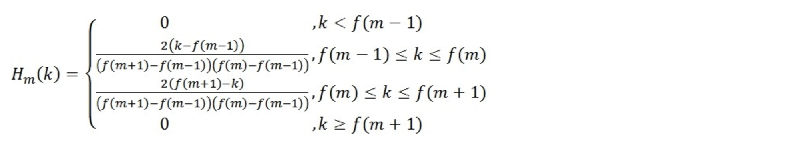
式中m代表第m个滤波器；k代表横轴坐标，也就是自变量；f(m)代表第m个滤波器的中心点的横坐标值。其效果图如下：
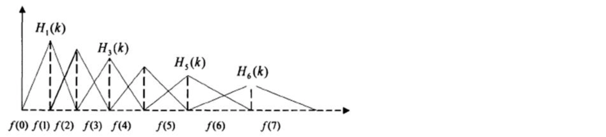
Mel滤波器组有两个主要的作用：①对能量谱进行平滑化，并消除谐波的作用，突出语音的共振峰；②降低运算量。
采用Mel滤波器组对上一步得到的功率谱估计进行滤波，得到维数和Mel滤波器组三角形个数一致的特征向量，数学表达为：

### 对数运算
这一步就是取上一步结果的对数，这样可以放大低能量处的能量差异。即，FBank特征为

FliterBank特征的效果图如下图所示(频率上限位8000Hz，下限为20Hz，特征维数为23)：
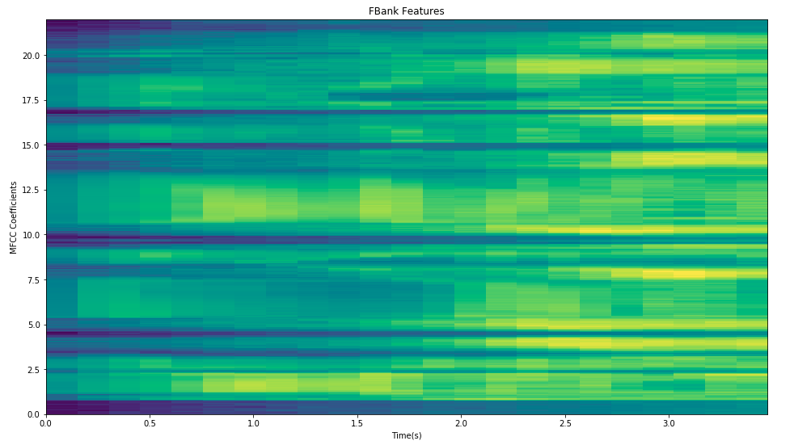
## 梅尔倒谱系数(MFCC）
FBank特征已经很贴近人耳的响应特性，但是仍有一些不足：FBank特征相邻的特征高度相关（相邻滤波器组有重叠），因此当我们用HMM对音素建模的时候，几乎总需要首先进行离散余弦变换(discrete cosine transform，DCT），通过这样得到MFCC(Mel-scale FrequencyCepstral Coefficients)特征。DCT的实质是去除各维信号之间的相关性，将信号映射到低维空间。
DCT的数学表达为：
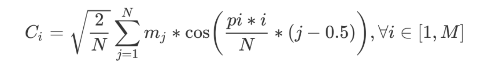
N是FBank的特征维度，M 是 DCT(离散余弦变换)之后的特征维度。DCT对于一般的语音信号作用后，所得的结果的前几个系数特别大，后面的系数比较小，一次一般仅保留前12-20个，这样也进一步压缩了数据。MFCC的效果图如下：
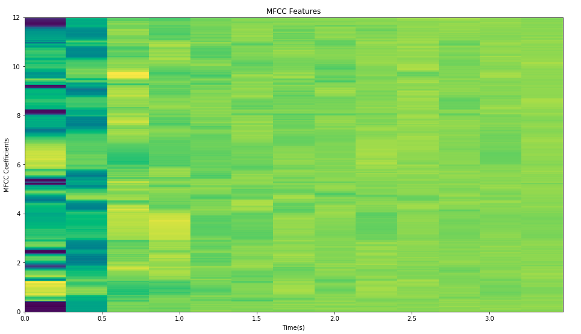
FBank和MFCC的对比：①FBank特征相关性较高，而DNN/CNN可以更好的利用这些相关性，使用FBank特征可以更多地降低WER；②MFCC具有更好的判别度，而对于使用对角协方差矩阵的GMM由于忽略了不同特征维度的相关性，MFCC更适合用来做特征。
## 差分(delta）
标准的倒谱参数MFCC是针对一段语音信号进行特征提取，只反映了语音参数的静态特性，语音的动态特性可以用这些静态特征的差分谱来描述。实验证明：把动、静态特征结合起来才能有效提高系统的识别性能。差分参数的计算可以采用下面的公式(t是帧数，典型值为2)：
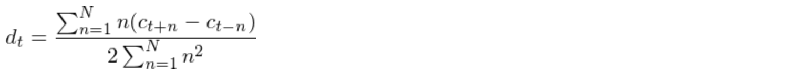
## 参考：
https://haythamfayek.com/2016/04/21/speech-processing-for-machine-learning.html
